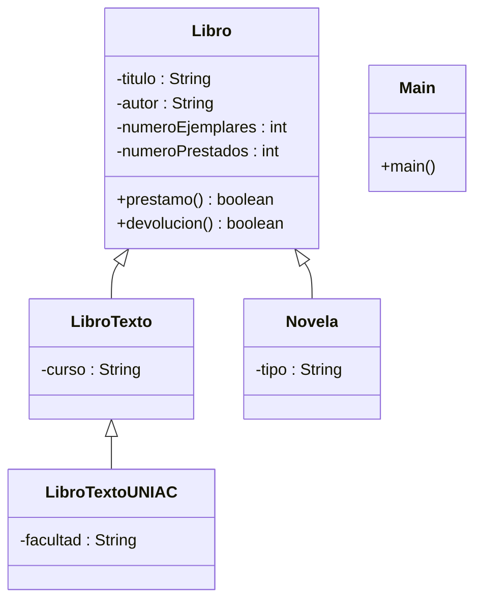

# Sistema de Biblioteca

Proyecto desarrollado en Java usando Maven.

## Diagrama UML

```mermaid
classDiagram

class Libro{
-titulo : String
-autor : String
-numeroEjemplares : int
-numeroPrestados : int
+prestamo() boolean
+devolucion() boolean
}

class LibroTexto{
-curso : String
}

class LibroTextoUNIAC{
-facultad : String
}

class Novela{
-tipo : String
}

class Main{
+main()
}

Libro <|-- LibroTexto
LibroTexto <|-- LibroTextoUNIAC
Libro <|-- Novela
```